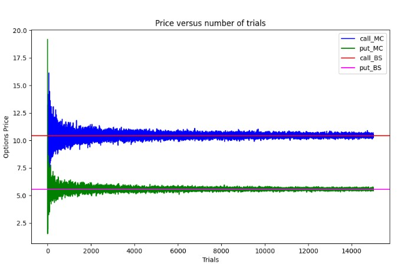

# Simple Monte Carlo Methods

## GBM 

This project simulates Geometric Brownian Motion (GBM) for financial assets and visualizes the simulated log return paths over time. Additionally, it provides a histogram of the final log returns of all simulated paths to visualize the distribution.

- Simulate log returns based on user-defined parameters.
- Plot the simulated log return paths.
- Display the distribution of final log returns.

## Options pricing model

This file simulates the call and put option price of standard European options using a simple monte carlo simulation. The graph is compared against the black scholes computation of the option price.

